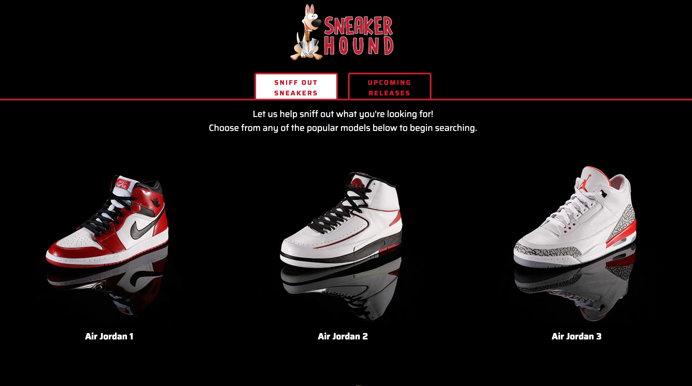

# Sneaker-Hound
 built using HTML/CSS/JavaScript/jQuery)

  

Sneaker Hound was designed to sneaker collectors find the perfect sneaker to add to their collection using API's from Nike and eBay.

----------------------------------------------------------------------------------------------------------------------  

How to use Sneaker Hound:

  
-The user will see two main buttons when visiting the app, "Sniff Out Sneakers" and "Upcoming Releases". Both can be clicked at any time.

----------------------------------------------------------------------------------------------------------------------  

## Upcoming Releases

  
-The "Upcoming Releases" button will bring the user to a page displaying the sneakers releasing soon from Nike and Air Jordan.  

-Clicking any shoe will bring the user to the Nike.com product page with more information about the release.  

----------------------------------------------------------------------------------------------------------------------  

## Sniff Out Sneakers

  
-The "Sniff Out Sneakers" button will bring the user to a grid of popular sneaker models for them to choose from.

-On the "Sniff Out Sneakers" page, the user can simply click one of the models in order to advance to the next page, then the user can input specific information about the sneaker they are searching for.

----------------------------------------------------------------------------------------------------------------------  

  
-Once the user has filled out the search requirements, clicking "Sniff Out Sneakers" will begin searching eBay for the results.  

----------------------------------------------------------------------------------------------------------------------  
  
  
-Once the app has found the users results, they can navigate threw multiple pages of results (if available) by using the previous and next page buttons located on the bottom of the screen.  

----------------------------------------------------------------------------------------------------------------------  

  

-Selecting any sneaker result will take the user to the eBay page where they may view additional details about the product and make their purchase.  
-If the user would like ot search for another sneaker, they may push the "Sniff Out Sneakers" button located on the top of the page at any time.

----------------------------------------------------------------------------------------------------------------------  
